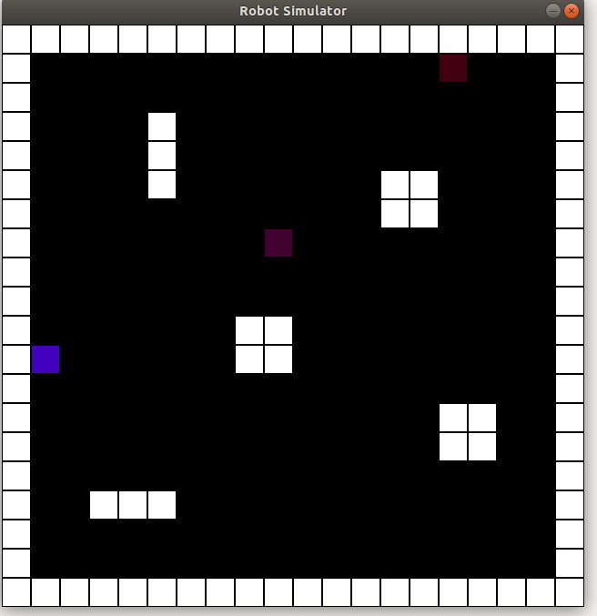

# Robot Simulator


This Program is a simple c++ implementation of a robot simulator. It spawns 3 robots at random location in the given map.
Robots moves every second, if they come across any obstacle then they change their direction randomly to Up, Down, Left or Right.
The Robot move function for all 3 robots are executed in separate threads.

The original task was to display the output in terminal, but here, I decided to use SDL2 graphics libraries for visualization.
- Each white block represents an obstacle.
- A random color generator script (by David Merfield) is been used to assign colors to each robot.


-----
### How to build
This code has been tested on Ubuntu 18.04
To build this code successfully, you will need to install SDL2 libraries.  

```
sudo apt-get install libsdl2-dev
```
you can refer to this webpage if you run into any problems: https://lazyfoo.net/tutorials/SDL/01_hello_SDL/linux/index.php

This project has a stub that builds with CMake and Make by running the following command from the project directory:

After that you can build this code by simply executing following steps
```
mkdir build && cd build
cmake ..
make

./roboagents
```
--------------------------
### Known bugs/improvement opportunities
- I am not yet completely familiar with the SDL libraries, so I was not able to debug following two bugs
  - The program pauses after 5-10 seconds in the beginning, but as soon as you move mouse across screen, it resumes.
  - The close button on GUI window / the key press doesn't always work.
- The simulator at this moment doesn't consider a robot as an obstacles, so you will see that robots will pass through each other at many times. Maybe in future there can be a mechanism that can keep track of these 'dynamic obstacles'.
--------------------------
Here's a short video of the Simulator in action:


--------------------------
This program simulates autonomous robots running around a 2D world. In
addition to running without bugs and meeting all of the following design criteria,
we will be evaluating the object-oriented design and coding style, so please
code as if you were handing it off to a colleague to maintain. You do not need
to write tests (unless it helps you), and full documentation is not necessary,
but please briefly comment any non-obvious code.

This project has two classes for you to finish implementing, Robot and World.
The World class encapsulates a simple 2D world.

* The world map is represented by a 2D data structure of your choice with each
coordinate either blocked or unobstructed. The map is a rectangle of arbitrary
size that is blocked around the entire border and has arbitrary internal
coordinates blocked. You do not have to handle map configuration edge cases.
* World provides a way to place robots, and keeps track of the location of them.
Each robot exists in a single coordinate space. There can be up to a few robots
on the map at a time.
* World provides a movement API for the Robot class.
  * A robot can try to move a single space in any direction (holonomic), but if
   that space is blocked the robot does not move. Robot receives whether the move
   was successful or no
* World continuously displays the world (obstacles plus robots) to the terminal
using ASCII. Below is example output with two robots A and B

1111111\
1A00001\
100B001\
1001101\
1001101\
1000001\
1111111


The Robot class defines a simple autonomous robot.
* The robot should move based on some simple behavior (such as move one space a second in one direction until blocked, then move in another direction). This behavior can be the same for each instance of Robot, and does not need to be complex.
* Robot cannot interact with or have knowledge about the world beyond the move API
* Each Robot instance should run independently and not depend on a global "tick" (ie, each should be in a different thread).

This project has a stub that builds with CMake and Make by running the following command from the project directory:
```
mkdir build && cd build && cmake .. && make
```
(we will be compiling it on gcc on Ubuntu). Take a look in `main.cpp`, `robot.h`, and `world.h` to see what has been implemented and for contextual instructions.

Please reach out with any questions. Good luck!


----
